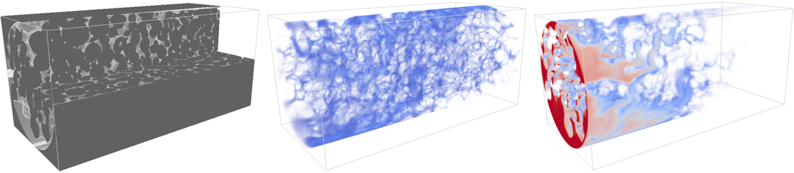

# QCCSRC

Libraries for high performance scientific computing, developed in the Qatar Carbonates and Carbon Storage Research Centre at Imperial College London by Farrel Gray.



Figure: Fluid flow velocity distribution (middle) and reactant concentration distribution (right) during injection into a rock core sample (left). Computed using a reactive transport model run on GPU cluster. For more details, see [Gray et al. (2018)](https://doi.org/10.1016/j.advwatres.2018.09.007)

## Table of Contents

* [About](#About)
* [Getting Started](#Getting-Started)
* [Libraries](#Libraries)
* [Contact](#Contact)

## About

The C++ header files included here are used in codes developed within the Qatar Carbonates and Carbon Storage Research Centre (QCCSRC) at Imperial College London. They provide useful library functions for:

* Reading input parameter files
* Buffered file reading/writing with array ordering operations
* 3D data grid class both on local memory systems and distributed over multi-node MPI systems
* Domain decomposition class for multi-node MPI systems
* Multithreading classes
* Accurate timer
* Topology mapping class for multi-node MPI systems, including GPUs

All libraries are compatible with both Linux and Windows systems.

## Getting Started

These static library files can easily be used in a project by including the relevant files, as shown

```C++

#include <InputFile.h>          //Reads input files
#include <DataFiles.h>          //Buffered file reading and writing with array transformation
#include <Grids.h>              //Manipulate 3D grids
#include <Decomposition.h>      //Lattice decomposition
#include <Threads.h>            //Local multi-threading
#include <Timer.h>              //Accurate timing
#include <FilePaths.h>		//Combines folder and file strings

#include <GridsMPI.h>		//Manipulate 3D grids distributed over MPI systems
#include <TopologyMPI.h>        //Map topology of MPI system (no GPUs)

#include <TopologyMPI.cuh>      //Map topology of MPI GPU system

```

The libraries <b>GridsMPI.h</b>, <b>TopologyMPI.h</b> and <b>TopologyMPI.cuh</b> are only usable if MPI libraries are included, and the library <b>TopologyMPI.cuh</b> also requires CUDA to be used. 

## Libraries

### InputFile.h

This class provides a way to read input parameters from a file. It allows a free form structure to be used, and supports both simple data types, arrays and complex nested data-structures.

#### 1. Example with simple data

Here is an example with simple data to be read in from Input.txt.

1.1 <b>Input.txt</b>

  Input values are assigned to named variables using the syntax below, and comments can also be added using C style '//'
    
```Text
//Simple data
    
InputStr = "String for reading"   //C style comments are allowed
		
InputInt = 30                     //Integer to be read in
		
InputFlt = 0.923
    
//Arrays of data
    
ListFlt = 0.035, 0.022, 5.243     //Lists can be separated with commas, spaces, semi-colons...
    
ListFlt2 = { 0.035                //...or spread over multiple lines using curly brackets
             0.022
             5.243 }
```

1.2 <b>InputFile.cpp</b>

In our cpp file we can define the variables to be read in using the <i>InputValueStructEx</i> struct and use the <i>InputFileReader</i> class to perform the read.

```C++

#include <InputFile.h>

//Input file values will be read into these variables

char  InputStr[64];    
int   InputInt;
float InputFlt;

float ListFlt[5];
float ListFlt2[5];

int CountListFlt;      //These will receive a count of how many values were read
int CountListFlt2;

//Define the data struct
    
InputValueStructEx Parameters[] = {

//{ [Name], [Ptr], [Data Length], [Count Max], [Data Type (eg DataType_Int)], [InputValueStructEx], [InputValueStructEx values count], [Ptr Count Read], [Required], [Description] },

  { "InputStr", InputStr,  sizeof(InputStr), 1, DataType_String, 0, 0, 0, false, "An input string" },
  { "InputInt", &InputInt, sizeof(int),      1, DataType_Int,    0, 0, 0, true,  "An input int" },
  { "InputFlt", &InputFlt, sizeof(float),    1, DataType_Float,  0, 0, 0, false, "An input float" },
  
  { "ListFlt",  &ListFlt[0],  sizeof(float), 5, DataType_Float, 0, 0, &CountListFlt,  false, "A list of floats" },
  { "ListFlt2", &ListFlt2[0], sizeof(float), 5, DataType_Float, 0, 0, &CountListFlt2, false, "A list of floats" },
			
};

const int nParams = sizeof(Parameters)/sizeof(InputValueStructEx);

//Perform the file read

void ReadInputFile(){

  InputFileReader InputFile;    //Define instance of InputFileReader class

  char FileName[] = "Input.txt";
  
  bool r = InputFile.ReadInputFile(FileName, Parameters, nParams);  //Read in input file
  
  if(r){    //Success
  
    printf("Values were read successfully\n");   
    
  }else{    //Print error message
  
    printf("Values were not read in: %s\n", InputFile.GetErrorStr(InputFile.GetErrorCode()));   
    
  }
  
}
```

The struct <i>InputValueStructEx</i> is defined

```C++
struct InputValueStructEx{
	const char* DataName;             //Name in input file
	void* Ptr;                        //Pointer to variable
	int   DataSz;                     //Max size of one data entry (bytes)
	int   Count;                      //Max number of values for lists
	int   DataType;                   //Data type enum eg DataType_Bool
	InputValueStructEx* DataStruct;   //If type is DataType_InputValueStructEx, pointer to another InputValueStructEx defining the data within the struct at Ptr (may be null)
	int   DataStructCount;            //If type is DataType_InputValueStructEx, the number of entries in DataStruct (may be null)
	int*  CountRead;                  //Returns the number of values read in (may be null)
	bool  Required;                   //Throws error if value not found in input file
	const char* Description;          //Description of the field (may be null)
};
```

Note that when reading in arrays of strings, the <i>DataSz</i> parameter should be set to the maximum length of each array entry (which includes the ending null character '\0'). Values are read into the char array at intervals of <i>DataSz</i>. For example, if we reading a maximum of 4 strings, each of 31 bytes, we would define our input string variable of 128 bytes, set <i>DataSz</i> = 32, and each array element would written to index 32 * n, for n = {0, 1, 2, 3}.

The DataType enumeration lists supported data types and is defined

```C++
enum InputFileDataType{
	DataType_Bool,
	DataType_Short,
	DataType_Int,
	DataType_LongLongInt,
	DataType_Float,
	DataType_Double,
	DataType_String,
	DataType_InputValueStructEx
};
```

#### 2. Example with complex data

The <i>InputFileReader</i> class also supports reading nested data structures, as shown in the following example

2.1 <b>Input.txt</b>

  Multiple levels of structures can be defined using curly brackets
    
```Text
ComplexData = {   { Name = "Item1"                     //Each element contains a structure of values
                    Value = 80                         //Int
                    FltList = 0.243, 0.334, 0.221 },   //List of floats
                    
                  { Name = "Item2"
                    Value = 27
                    FltList = 0.264, 0.970, 0.396, 0.285, 0.857 },
                    
                  { Name = "Item3"
                    Value = 935
                    FltList = 0.735, 0.497, 0.104 }
              }
```

Datasets such as this can be read in by setting the <i>DataType</i> = DataType_InputValueStructEx in <i>InputValueStructEx</i>, as shown in the following code
  
  2.2 <b>InputFile.cpp</b>

```C++
...

//Input file values will be read into these variables

struct DataStruct{    //This defines the data within each complex data element
  char Name[256];
  int Value;
  float Flt[6];
  int FltCount;
};

DataStruct SubData[4];   //Receives data from complex list
int CountSubData;        //Count how many struct elements were read in

//Define the data structs

InputValueStructEx DataStructParams[] = {     //This InputValueStructEx defines the variables in the sub entries

//{ [Name], [Ptr], [Data Length], [Count Max], [Data Type (eg DataType_Int)], [InputValueStructEx], [InputValueStructEx values count], [Ptr Count Read], [Required], [Description] },

  { "Name",    (void*)offsetof(DataStruct, Name),  sizeof(char)*256, 1, DataType_String, 0, 0, 0, false, 0 },
  { "Value",   (void*)offsetof(DataStruct, Value), sizeof(int),      1, DataType_Int,    0, 0, 0, true, 0 },
  { "FltList", (void*)offsetof(DataStruct, Flt),   sizeof(float),    6, DataType_Float,  0, 0, (int*)offsetof(DataStruct, FltCount), true, 0 },

};
    
InputValueStructEx Parameters[] = {

//{ [Name], [Ptr], [Data Length], [Count Max], [Data Type (eg DataType_Int)], [InputValueStructEx], [InputValueStructEx values count], [Ptr Count Read], [Required], [Description] },

  { "ComplexData", StructRead, sizeof(DataStruct), 4, DataType_InputValueStructEx, DataStructParams, sizeof(DataStructParams)/sizeof(InputValueStructEx), &CountReadStruct, false, 0 },
			
};

...
```

Here we define a second list of parameters using <i>InputValueStructEx</i> struct, which define entries for the sub-data. Now, the "ComplexData" entry in the list of the main parameters has <i>InputValueStructEx.Ptr</i> set to an array of <i>DataStruct</i>, and the <i>InputValueStructEx.DataStruct</i> field is set to the sub parameters list DataStructParams.

Notice how pointers to data locations in the sub data <i>InputValueStructEx</i> are now relative to the struct pointer. This is achieved by using the <i>offsetof</i> macro. Note also that <i>offsetof</i> is only certain to behave correctly if the struct is POD ("plain old data").

#### 3. Example with MPI threads

If MPI is used, and the preprocessor definition MPI_INCLUDED is defined, then a second constructor for the InputFileReader class becomes available

```C++
InputFileReader(MPI_Comm Comm, int SrcThread);
```

All MPI threads initialise the class using the group communicator <i>Comm</i> and the index of the thread which will perform the file read. All threads then call the member function ReadInputFile(...) as in example 1.2, and this now automatically distributes the parameters read from the input file to all threads, and makes the result of GetErrorCode() available to all threads.

### DataFiles.h

### Grids.h

The <i>Grid</i> class provides a container for 3D (as well as 2D and 1D) datasets. It also provides useful capabilities for distributed computing applications, such as the ability to extract subvolumes with extra 'ghost' layers which may be over loop boundaries.

#### 1. Example of 3D grid

The following example creates a 3D grid of type int and reads and writes data from a file.

```C++

int main(){

    Grid<int> DataSet(100, 100, 100);      //Creates a 3D dataset of dimensions 100 x 100 x 100, with a single component

    DataSet.ReadFromFile("C:/Data.raw", true, DataFileBase::Type_char);   //Reads 8-bit data from file in binary format and automatically converts it to int
    
    for(int z=0; z<100; z++)
    for(int y=0; y<100; y++)
    for(int x=0; x<100; x++){
    
	    DataSet(x, y, z) += 2;         //The () operator can be used to return a reference to a particular value
    
    }

    DataSet.WriteToFile("C:/DataOut.raw", true, false);  //Writes data in 32-bit int binary format

    return 0;
}
```
#### 2. Grid Members

A number of different constructors are available
```C++
Grid<class T>(int SizeX,  int SizeY, int SizeZ, int VectorSize);                          //Create grid of dimensions SizeX x SizeY x SizeZ with VectorSize components
Grid<class T>(long long SizeX,  long long SizeY, long long SizeZ, long long VectorSize);
Grid<class T>(int SizeX,  int SizeY, int SizeZ);                                          //Create grid of dimensions SizeX x SizeY x SizeZ with a single component
Grid<class T>(long long SizeX,  long long SizeY, long long SizeZ);
Grid<class T>(int SizeX,  int SizeY);                                                     //Create grid of dimensions SizeX x SizeY with a single component
Grid<class T>(long long SizeX,  long long SizeY);
Grid<class T>(int SizeX);                                                                 //Create 1D array of SizeX elements
Grid<class T>(long long SizeX);

Grid<class T>(Grid<T> &GridRef);                     //Create grid copied from GridRef (reference)
Grid<class T>(Grid<T>* GridRef);                     //Create grid copied from GridRef (pointer)
Grid<class T>(Grid<T> &GridRef, GridRegion Region);  //Create grid copied from a subregion Region of GridRef (reference)
Grid<class T>(Grid<T> &GridRef, Coarsegrain CG_Op);  //Create grid GridRef (reference) coarsegrained

//Create a grid from the array DataArr, of dimensions SizeX x SizeY x SizeZ with VectorSize components, either deep copy (new array allocated) or shallow copy (pointer copied), which will be deleted by the destructor if FreeShallowCopy = true
Grid<class T>(T* DataArr, bool ShallowCopy, bool FreeShallowCopy, long long SizeX,  long long SizeY, long long SizeZ, long long VectorSize);

```

A reference to the data at a particular coordinate can be obtained using the bracket operator (), as in example 1. This has multiple overloads.

```C++

T& Grid<class T>::operator()(long long X, long long Y, long long Z, long long n);  //Returns reference to value at X, Y, Z component n
T& Grid<class T>::operator()(int X, int Y, int Z, int n);
T& Grid<class T>::operator()(long long X, long long Y, long long Z);
T& Grid<class T>::operator()(int X, int Y, int Z);
T& Grid<class T>::operator()(long long X, long long Y);
T& Grid<class T>::operator()(int X, int Y);
T& Grid<class T>::operator()(long long X);
T& Grid<class T>::operator()(int X);

```

Likewise, two methods <i>Get</i> and <i>GetPtr</i> can be used to obtain the value and pointer to the value at a particular coordinate respectively. These have the same overloads as the () operator

```C++
T Grid<class T>::Get(long long X, long long Y, long long Z, long long n);      //Get value at X, Y, Z, component n

T* Grid<class T>::GetPtr(long long X, long long Y, long long Z, long long n);  //Get pointer to element at X, Y, Z, component n
```

A number of functions are also available to set the value at a particular coordinate. These have the same overloads as the Get functions, except that the extra parameter </i>Value</i> is always included as the last parameter

```C++
void Grid<class T>::Set(long long X, long long Y, long long Z, long long n, T Value); //Set value at X, Y, Z, component n
```

Values can also be set throughout the grid, or in specific regions using the <i>SetAll</i> function. Similarly, value replacement can be performed using <i>ReplaceValue</i>, and the function <i>ScaleValues</i> can be used to multiply all values by a given factor

```C++
void Grid<class T>::SetAll(T Value);                          //Set all to Value
void Grid<class T>::SetAll(T Value[]);                        //Set all to Value[], with n components
void Grid<class T>::SetAll(T Value, GridRegion Region);       //Set all to Value in Region
void Grid<class T>::SetAll(T Value[], GridRegion Region);     //Set all to Value[], with n components in Region      

void Grid<class T>::ReplaceValue(T ValueFind, T ValueReplace);                        //Replace all ValueFind with ValueReplace
void Grid<class T>::ReplaceValue(T ValueFind[], T ValueReplace[]);                    //Replace all ValueFind[] with ValueReplace[] (vectors with n components)
void Grid<class T>::ReplaceValue(T ValueFind, T ValueReplace, GridRegion Region);     //Replace all ValueFind with ValueReplace in Region
void Grid<class T>::ReplaceValue(T ValueFind[], T ValueReplace[], GridRegion Region); //Replace all ValueFind[] with ValueReplace[] (vectors with n components) in Region

void Grid<class T>::ScaleValues(T Scale);                         //Multiply all values by Scale
void Grid<class T>::ScaleValues(T Scale, GridRegion Region);      //Multiply all values by Scale in Region
```
#### 3. GridRegion

The <i>GridRegion</i> struct can be used to specify a 3D region and has the following constructors

```C++
GridRegion::GridRegion(long long XStart, long long XEnd, long long YStart, long long YEnd, long long ZStart, long long ZEnd);
GridRegion::GridRegion(int XStart, int XEnd, int YStart, int YEnd, int ZStart, int ZEnd);
GridRegion::GridRegion(long long XStart, long long XEnd, long long YStart, long long YEnd);
GridRegion::GridRegion(int XStart, int XEnd, int YStart, int YEnd);
GridRegion::GridRegion(long long XStart, long long XEnd);
GridRegion::GridRegion(int XStart, int XEnd);
GridRegion::GridRegion();
```
The default range for directions not specified in the constructor parameters is 0, 1.

Individual ranges can be set using

```C++
void GridRegion::SetRangeX(long long XStart, long long XEnd);  //Set range in X
void GridRegion::SetRangeY(long long YStart, long long YEnd);  //Set range in Y
void GridRegion::SetRangeZ(long long ZStart, long long ZEnd);  //Set range in Z
```

This struct can also be used to compute a number of useful metrics

```C++
long long GridRegion::SizeX();         //Size in X
long long GridRegion::SizeY();         //Size in Y
long long GridRegion::SizeZ();         //Size in Z

long long GridRegion::CountCells();    //Number of cells contained in region
bool GridRegion::IsZero();             //Size is 0 in all directions

bool GridRegion::Contains(long long x, long long y, long long z);  //Whether coordinate is within this region
bool GridRegion::TestOverlap(GridRegion& Region);  //Whether Region (ref) overlaps with this region
bool GridRegion::TestOverlap(GridRegion* Region);  //Whether Region (ptr) overlaps with this region
bool GridRegion::FitsWithin(GridRegion& Region);   //Whether Region (ref) fits entirely within this region
bool GridRegion::FitsWithin(GridRegion* Region);   //Whether Region (ptr) fits entirely within this region
```

New regions can be computed from the following operations

```C++
GridRegion GridRegion::Translate(long long dx, long long dy, long long dz);  //Return new GridRegion translated by dx, dy, dz
GridRegion GridRegion::Overlap(GridRegion& Region);         //Return new GridRegion equal to the overlap of Region (ref) with this GridRegion
GridRegion GridRegion::Overlap(GridRegion* Region);         //Return new GridRegion equal to the overlap of Region (ptr) with this GridRegion
```

#### 4. Grid Transformations

A useful capability of the <i>Grid</i> class is the ability to perform coarsegraining operations, extract subgrids and perform inversions in Cartesian directions. In this example, we read in a grid from a file, and scale the image down.

```C++
int main(){

    int SzX = 100;
    int SzY = 100;
    int SzZ = 100;

    Grid<float> DataSet(SzX, SzY, SzZ);      //Creates a 3D dataset of dimensions 100 x 100 x 100, with a single component

    DataSet.ReadFromFile("C:/Dataset.raw", true);   //Reads 32-bit float data from file in binary format
    
    double ImageScale = 1.5;    //Reduce 3D image size by factor of 1.5
    
    int SzXCG = (int)(SzX / ImageScale);
    int SzYCG = (int)(SzY / ImageScale);
    int SzZCG = (int)(SzZ / ImageScale);
    
    CoarseGrain CG(SzXCG, SzYCG, SzZCG, false);   //Define a coarsegraining operation, specifying new grid size and set discrete mode to false
    
    Grid<float> DataSetGC(DataSet, CG);     //Creates a new grid containing a coarsegrained version of DataSet

    DataSetGC.WriteToFile("C:/DatasetOut.raw", true, false);  //Writes data in 32-bit float binary format

    return 0;
}
```

In the above code, we use the coarsegraining constructor to create a new, scaled down version of the initial dataset. The <i>CoarseGrain</i> struct can be initialised using

```C++
Coarsegrain::Coarsegrain(long long SizeX, long long SizeY, long long SizeZ, bool DiscreteMode);
Coarsegrain::Coarsegrain(int SizeX, int SizeY, int SizeZ, bool DiscreteMode);
Coarsegrain::Coarsegrain(long long SizeX, long long SizeY, long long SizeZ);
Coarsegrain::Coarsegrain(int SizeX, int SizeY, int SizeZ);
```

SizeX, SizeY and SizeZ define the new size of the grid, which must be less than the original, but not necessarily by the same factors. When DiscreteMode = true, coarsegrained cells contain the mode value of their overlap on the original grid, otherwise they use the average value. DiscreteMode = true is useful for preserving the values in discrete e.g. integer datasets, whereas the continuous average is useful for smoothing over interfaces. The default value is DiscreteMode = false.

In preference to using constructors, the <i>Grid</i> class can read in from other <i>Grid</i> instances using the following member functions

```C++
void Grid::ReadGridCoarsegrained(Grid& GridRef, Coarsegrain CG_Op);                       //Read coarsegrained version of GridRef into Grid
void Grid::ReadGridCoarsegrained(Grid& GridRef, Coarsegrain CG_Op, GridPosition Offset);  //Read coarsegrained version of GridRef into Grid at Offset position

void Grid::ReadSubGrid(Grid& GridRef, GridRegion Region);                                     //Read Region of GridRef into Grid
void Grid::ReadSubGrid(Grid& GridRef, GridRegion Region, GridPosition Offset);                //Read Region of GridRef into Grid at Offset position
void Grid::ReadSubGrid(Grid& GridRef, GridRegion Region, GridPosition Offset, bool Flip[3]);  //Read Region of GridRef into Grid at Offset position and invert in specified Cartesian directions

void Grid::ReadGrid(Grid& GridRef);                                      //Read GridRef into Grid
void Grid::ReadGrid(Grid& GridRef, GridPosition Offset);                 //Read GridRef into Grid at Offset position
void Grid::ReadGrid(Grid& GridRef, GridPosition Offset, bool Flip[3]);   //Read GridRef into Grid at Offset position abd invert in specified Cartesian directions
```

The <i>GridPosition</i> struct defines a position at X, Y, Z and has the constructors and members

```C++
long long GridPosition::x;    //Coordinates
long long GridPosition::y;
long long GridPosition::z;

GridPosition::GridPosition(long long X, long long Y, long long Z);
GridPosition::GridPosition(int X, int Y, int Z);
GridPosition::GridPosition(long long X, long long Y);               //Default Z = 0
GridPosition::GridPosition(int X, int Y);
GridPosition::GridPosition(long long X);                            //Default Y and Z = 0
GridPosition::GridPosition(int X);

long long GridPosition::operator[](int i);  //Return x, y, or z coordinate for i = 0, 1, or 2 respectively
```


### GridsMPI.h

The <i>GridMPI</i> class is particularly useful for handling very large datasets on distributed systems. This is because the 3D grid is automatically partitioned and distributed amongst MPI threads, meaning that bottlenecks due to single node memory limitations are avoided.

#### 1. Example

This simple example creates a <i>GridMPI</i> class, reads in a dataset and operates on it before writing to another file. By passing the MPI_Comm parameter, the class transparently performs a grid partitioning and distribution over all MPI threads in the communicator group.

```C++

int main(int argc, char *argv[]){

    //MPI Initialisation

    MPI_Init(&argc, &argv);
    
    int nThreads;
    int tId;
    
    MPI_Comm_size(MPI_COMM_WORLD, &nThreads);	//Get number of threads running
    MPI_Comm_rank(MPI_COMM_WORLD, &tId);	//Get thread ID (index from 0 -> nThreads-1)
    
    //GridMPI
    
    int GridSz[3] = {100, 100, 100};
    
        //Create GridMPI distributed over all MPI threads

    GridMPI<float> DataSet(MPI_COMM_WORLD,        //MPI Communicator
                           0,                     //MPI tag threads will use internally for communicating
			   GridSz[0],             //Grid size
			   GridSz[1],
			   GridSz[2],
			   1                  );  //Number of vector components

    //Read data from file

    DataSet.ReadFromFile("C:/DataSet.raw", true, 0);   //Uses MPI thread 0 to read from file and transparently distributes amongst all threads

    //Operate on data
    
    GridRegion Rgn( 25, 75,
                    25, 75,
                    25, 75  );  //Central cube region
		   
    long long Count = DataSet.CountOccurences((float)0.0f, Rgn);   //Counts 0 values in GridRegion
    
    if(tId == 0)
        printf("Counted %lli zeros in region (%s)\n", Count, Rgn.ToStr());
	
    DataSet.SetAll(1.0f, Rgn);   //Set all values in GridRegion
    
    //Write to file
    
    DataSet.WriteToFile("C:/DataSetOut.raw", true, false, 0);  //Thread 0 writes file, data transparently coalesced from all threads
    
    MPI_Finalize();
    
    return 0;
}

```

When the dataset is read in from a file, the class automatically distributes the data to the other threads, depending on their partitions. This is done in a buffered way which minimises extra memory usage on the reading thread. The same applies to the file writing operation. The maximum size of the buffer can be set using

```C++
void GridMPI<class T>::SetMaxBufferSize(long long BufSizeBytes);
```

The default size is 32 MB, and the maximum value which can be set is 2 GB.

The <i>GridMPI</i> class also exposes similar data operations to the <i>Grid</i> class, such as counting and set functions which can work on subregions. In this case, operations on a single subregion may involve some or all of the MPI threads, depending how the dataset has been distributed internally. In cases where more specific, user-defined operations are needed, the class makes available information on the distribution of data as an array of <i>GridRegion</i> structs

```C++
GridRegion* GridMPI<class T>::Regions;
```

Each entry in this array is the region of the overall grid located on the MPI thread with the corresponding rank. The following members can then be used to work locally on the data at each MPI thread.

```C++
T*       GridMPI<class T>::Data;       //The internal array of data on local MPI thread
Grid<T>* GridMPI<class T>::GridLocal;  //Grid class container for Data

void     GridMPI<class T>::CoordGlobalToLocal(int Pos[3]);             //Transforms a global coordinate to local data coordinate
void     GridMPI<class T>::CoordGlobalToLocal(int* x, int* y, int* z);
void     GridMPI<class T>::CoordLocalToGlobal(int Pos[3]);             //Transforms a local data coordinate to global coordinate
void     GridMPI<class T>::CoordLocalToGlobal(int* x, int* y, int* z);
```

The member functions <i>CoordGlobalToLocal</i> and <i>CoordLocalToGlobal</i> can be used to map coordinates on the global grid to the corresponding coordinate in the local data grid, and vice versa. The <i>GridLocal</i> member exposes a <i>Grid</i> class which contains the local data.

The <i>GridMPI</i> class also implements members to obtain, read in and move subgrid regions.

```C++
void GridMPI<class T>::ObtainSubGrid(Grid<T>& GridOut, GridRegion Region);                                          //Obtain data in Region in local Grid GridOut
void GridMPI<class T>::ObtainSubGrid(Grid<T>& GridOut, GridRegion Region, GridPosition OffsetOut);                  //Obtain data in Region in local Grid GridOut offset by OffsetOut
void GridMPI<class T>::ObtainSubGrid(Grid<T>& GridOut, GridRegion Region, GridPosition OffsetOut, int Boundary[6]); //Obtain data in Region in local Grid GridOut at offset OffsetOut, including extra boundary layers

void GridMPI<class T>::ReadSubGrid(Grid<T>& GridRef, GridRegion Region);                                        //Read local GridRef into Region of global grid
void GridMPI<class T>::ReadSubGrid(Grid<T>& GridRef, GridRegion Region, GridPosition ReadOffset);               //Read from local GridRef, at offset ReadOffset into Region of global grid
void GridMPI<class T>::ReadSubGrid(Grid<T>& GridRef, GridRegion Region, GridPosition ReadOffset, bool Flip[3]); //Read from local GridRef, at offset ReadOffset into Region of global grid and invert in specified Cartesian directions

void GridMPI<class T>::CopyRegion(GridRegion RegionFrom, GridPosition PosTo);                //Move data in RegionFrom to new position PosTo in global grid
void GridMPI<class T>::CopyRegion(GridRegion RegionFrom, GridPosition PosTo, bool Flip[3]);  //Move data in RegionFrom to new position PosTo in global grid and invert in specified Cartesian directions
```

<i>ObtainSubGrid</i> functions extract regions from the grid into local <i>Grid</i> classes. This is done on a per-thread basis, meaning that each MPI thread may specify its own GridRegion to extract, and this will be copied from the global grid into the local <i>Grid</i> GridOut. This function includes the possibility of specifying extra boundary layers using the int Boundary[6] parameter. These specify a thickness in +X, -X, +Y, -Y, +Z and -Z respectively of extra nodes which are copied from the global geometry. The advantage of using this parameter is that extra boundary nodes will be obtained from over the grid boundaries if necessary. This is useful for obtaining extra "ghost" data transfer layers using loop boundary conditions in simulation models.

<i>ReadSubGrid</i> functions read data from local <i>Grid</i> data into the global grid. This is again done on a per-thread basis, so individual threads specify the <i>GridRegion</i> their data is written to. The optional bool Flip[3] parameter can flip the data in each of the 3 Cartesian directions.

Regions of the global grid can also be coped from one position to another using the <i>CopyRegion</i> function, again with the option to flip the data in the Cartesian directions. All MPI threads must specify the same regions and positions for this function.

Note that for <i>ObtainSubGrid</i>, <i>ReadSubGrid</i> and <i>CopyRegion</i> functions, all MPI threads in the MPI_Comm group must make simultaneous calls. If a thread does not need to read or write data using <i>ObtainSubGrid</i> and <i>ReadSubGrid</i>, it can specify a zero region (e.g. GridRegion(0, 0, 0, 0, 0, 0)). This because the threads may be needed internally to transfer data to other threads.

These functions are optimised for large-scale parallel systems, which may have thousands of threads. The implementation of these functions runs internal copy operations in parallel, using sub-groups of threads depending on the overlap of the required regions with the data partitions.

File read and write members are

```C++
int GridMPI<class T>::ReadFromFile(char* FileName, bool Binary, int ReadThread);                                            //Read data from file
int GridMPI<class T>::ReadFromFile(char* FileName, bool Binary, GridRegion Region, int ReadThread);                         //Read data from file into GridRegion of grid
int GridMPI<class T>::ReadFromFile(char* FileName, bool Binary, DataType FileDataType, GridRegion Region, int ReadThread);  //Read data from file into GridRegion of grid, converting data type from FileDataType

int GridMPI<class T>::WriteToFile(const char* FileName, bool Binary, bool VTKHeader, int WriteThread);                      //Write to file using MPI thread with Id WriteThread
int GridMPI<class T>::WriteToFile(const char* FileName, bool Binary, bool VTKHeader, GridRegion Region, int WriteThread);   //Write GridRegion to file using MPI thread with Id WriteThread
```

A single MPI thread whose index is ReadThread (or WriteThread) performs the actual file read (or write), automatically transfering data back from other threads in a buffered way. The bool Binary parameter specifies whether data is written out in raw binary format, otherwise ASCII text. bool VTKHeader optionally adds a Paraview VTK header.

### Decomposition.h

The <i>Decomposition</i> class performs 1D, 2D and 3D grid decomposition using node-weighted size balancing. It has 3 main operating modes: 1) using <i>Grid</i> data on a single-threaded system, 2) using <i>Grid</i> data on a multithreaded MPI system and 3) using <i>GridMPI</i> data on a multithreaded MPI system. It also implements methods to map regions of neighbouring partitions where data transfer is needed, and distrbute and recombine data grids over MPI threads.

#### 1. Example of node-weighted domain decomposition on a single thread

```C++

int main(){

    int GridSzX = 100;                                 //Grid size
    int GridSzY = 100;
    int GridSzZ = 100;


    //Read in dataset

    Grid<int> DataSet(GridSzX, GridSzY, GridSzZ);             //Create Grid to contain 3D dataset

    int ret = DataSet.ReadFromFile("C:/DataSet.raw", true);   //Read in dataset from file

    if(ret != 0){
        printf("Unable to read dataset\n");
    }

    //Perform grid decomposition

    int nPartitions = 16;                              //Number of partitions to divide grid into

    char DecompStr[] = "zyx";                          //Decomposition mode: hierarchical, first in z then y then x

    int ActiveCellsValue = 0;                          //Declare values 0 as active cell

    Decomposition<int> Decomp(&DataSet, nPartitions, DecompStr, ActiveCellsValue);  //Create Decomposition class which performs the decomposition

    if(!Decomp.Success){
        printf("Grid decomposition failed\n");
        return 0;
    }


    //Obtain subregions

    for(int i=0; i<nPartitions; i++){

        GridRegion Region = Decomp.Partitions[i].Region;         //The region of each partition

        printf("Region [%i] in (%s) with %lli active cells\n",
                i,
                Region.ToStr(),
                Decomp.Partitions[i].NodeCount               );
			  
        for(int z=Region.z0; z<Region.z1; z++)
        for(int y=Region.y0; y<Region.y1; y++)
        for(int x=Region.x0; x<Region.x1; x++){		//Highlight partitions

            if(DataSet(x, y, z) != 0)
                DataSet(x, y, z) = i + 1;

        }

    }


    //Output decomposition to file

    DataSet.WriteToFile("C:/DataSetDecomp.raw", true, false);

    return 0;
}
```

### Threads.h

This defines a class called <i>Threads</i> which creates local threads and a <i>Mutex</i> class for synchronisation. It provides similar capabilities to the C++11 thread library, however the <i>Threads</i> class has its own inter-thread synchronisation routines built in which simplifies coding for highly parallel applications.

#### 1. Example with thread creation and synchronisation

In this example, we use the <i>Threads</i> class to create a number of parallel threads, and demonstrate the synchronisation routines

```C++

int ThreadWork(Threads::Thread* thread){                             //Runs with multiple threads
        
    int Arg = *((int*)thread->Data);

    printf("Thread Id = %i with argument %i\n", thread->Id, Arg);
        
    thread->SyncThreads();                                           //Synchronise threads

    printf("Finished (%i)\n", thread->Id);

    return 0;
}


int main(){

    Threads Worker;           //Initialise a Threads class

    int Arg = 3;              //Data passed to thread

    Worker.RunThreads(4, ThreadWork, &Arg);   //Runs 'ThreadWork' with 4 threads

    return 0;
}

```
The <i>Threads</i> class is initialised and then the member function <i>RunThreads</i> is called which creates n threads. The ThreadWork function recieves a single parameter of type <i>Threads::Thread</i> which contains the following members

```C++
void* Threads::Thread::Data;                       //The argument passed by RunThreads(...)
int   Threads::Thread::Id;                         //Thread index (from 0 to n-1)
int   Threads::Thread::nThreads;                   //The number of threads running

void  Threads::Thread::SyncThreads();              //Block until all running threads reach this point
void  Threads::Thread::SyncThreads(int* nActive);  //Same as SyncThreads() but returns the current number of running threads in *nActive
```

These members allow each thread to know its index, the number of threads running as well as synchronize with one another. If some threads return before reaching SyncThreads(), then only running threads will wait, and the overload SyncThreads(int* nActive) can be used to determine how many threads are still running.

The <i>Threads::RunThreads(...)</i> function has multiple variants. <i>RunThreads(...)</i> functions block until all threads have returned, whereas the <i>RunThreadsAsync(...)</i> functions return immediately after creating the threads, which now run in parallel to the host thread.

```C++
bool Threads::RunThreads(int n, int (*Addr)(Threads::Thread*) );                 //Run n threads at Addr 
bool Threads::RunThreads(int n, int (*Addr)(Threads::Thread*), void* Data);      //Run n threads at Addr and pass Data as argument (copied to void* Threads::Thread::Data)

bool Threads::RunThreadsAsync(int n, int (*Addr)(Threads::Thread*) );            //Same as RunThreads but returns immediately
bool Threads::RunThreadsAsync(int n, int (*Addr)(Threads::Thread*), void* Data); 
```

The Threads class exposes two further synchronisation routines for the host thread, once <i>RunThreadsAsync</i> has been called. These are

```C++
bool Threads::IsRunning();                  //Check if any threads are still running
bool Threads::ThreadIsRunning(int tId);     //Check if thread with index tId is running

void Threads::WaitFinish();                 //Wait for all threads to complete
```

Finally, the host thread can obtain the int return value of any of the threads using

```C++
int Threads::ThreadReturnValue(int tId);    //Returns the return value of thread with index tId
```

#### 2. Mutex class

The <i>Threads.h</i> library also contains a simple mutex class with a lock function which can be used to control access to resources in a system with multiple threads. Its members are

```C++
Mutex::Mutex();                //Default constructor

void Mutex::Lock(bool Lock);   //Acquire the lock (Lock = true) or release the lock (Lock = false)
```

### Timer.h

This file provides a simple high resolution timer class called <i>SimulationTimer</i>, which compatible with both Linux and Windows.

#### 1. Example

```C++

int main(){

    SimulationTimer Timer;      //Initialise timer class, which automatically begins counting
    
    while(true){
    
    	sleep(1);
    
        double dtStep = Timer.GetTimeSinceLastStep();  //Returns time since GetTimeSinceLastStep() was last called in seconds
        double dtTot  = Timer.GetSimulationTime();     //Returns time since SimulationTimer class was intialised in seconds
        
	printf("Time since last check: %.6f s, total time: %.6f s\n", dtStep, dtTot);
    }

    return 0;
}

```

The following methods can be used to obtain time intervals


```C++

double SimulationTimer::GetTimeSinceLastStep();      //Returns time since GetTimeSinceLastStep or GetTimeSinceLastStepms was last called in seconds
double SimulationTimer::GetTimeSinceLastStepms();    //Returns time since GetTimeSinceLastStep or GetTimeSinceLastStepms was last called in milliseconds
double SimulationTimer::GetSimulationTime();         //Returns time since SimulationTimer class was intialised in seconds

```

The timer class can also be reset using

```C++
void SimulationTimer::Reset();    //Reset timer
```

A variety of different time formats can be printed to the console using

```C++
void SimulationTimer::PrintTime(double Seconds);                      //Print time with default format (TimeFormat_Day_Hour_Min_Sec)
void SimulationTimer::PrintTime(double Seconds, TimeFormat Format);   //Print time with chosen format from TimeFormat enumeration
```

Time formats can be chosen from the <i>TimeFormat</i> enumeration


```C++
enum TimeFormat{
    TimeFormat_ms,                //Milliseconds only e.g. "10ms"
    TimeFormat_Sec,               //Seconds only e.g. "10s"
    TimeFormat_Min,               //Minutes only e.g. "10m"
    TimeFormat_Hour,              //Hours only e.g. "10h"
    TimeFormat_Day,               //Days only e.g. "10d"

    TimeFormat_Sec_ms,            //Seconds and milliseconds e.g. "10s 305ms"
    TimeFormat_Min_Sec,           //Minutes and seconds e.g. "10m 30s"
    TimeFormat_Hour_Min_Sec,      //Hours, minutes and seconds e.g. "5h 10m 3s"
    TimeFormat_Day_Hour_Min_Sec,  //Days, hours, minutes and seconds e.g. "4d 7h 37m 9s"
};

```

### FilePaths.h

### Topology.cuh
